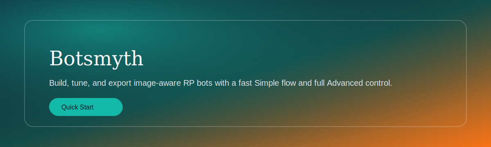
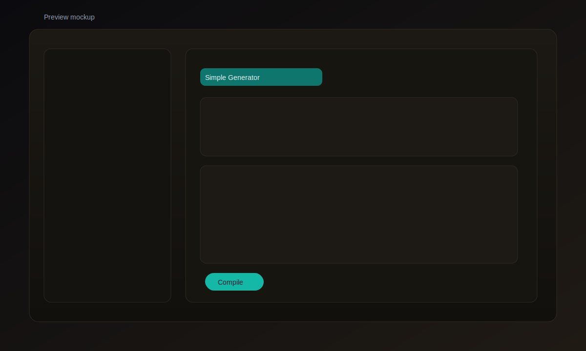

# Botsmyth



[](https://www.python.org/)
[](https://flask.palletsprojects.com/)
[](#data--storage)
[](#)

Build, tune, and export image-aware RP bots with a fast Simple flow and full Advanced control. Generate polished character packs (Description, First Messages, Scenario, Example Dialogues), test vision, and export to popular card formats.



## Highlights
- Simple + Advanced modes with a guided onboarding tour
- Compile workflow that generates the full 4‑section pack in one pass
- Image uploads with vision-aware generation and a built-in image viewer
- Token target presets per section for predictable output length
- Local autosave + version history
- Export to Card v2, Janitor, Risu, Prompt TXT, and PNG

## Quick Start
### Windows (recommended)
1) Double‑click `quickstart.bat`
2) The script installs requirements if needed and launches the app

### Manual
```bash
python -m venv .venv
.\.venv\Scripts\activate
pip install -r requirements.txt
python botmaker.py
```
Or, if you're on ***Windows,***
Open a terminal in the directory quickstart.bat is stored in, and type 
```bash
.\quickstart.bat
```
And it will automatically install all requirements AND open the app.

Open `http://localhost:8000` in your browser.

## Usage
1) **Simple Generator**: add original input + optional name/age/species.
2) **Generate**: create descriptions, first messages, scenarios, and dialogues.
3) **Compile**: produce a clean 4‑section export‑ready pack.
4) **Apply Outputs**: push compiled outputs into the editable fields.
5) **Export**: choose Card v2/Janitor/Risu/Prompt/PNG.

## Image Workflow
- Upload up to the configured max images.
- Click any image to open the **Image Viewer**.
- Library cards show a stacked carousel preview of the bot’s images.

## Output Length Targets
In **Compile**, set minimum token targets for:
- Description
- First Messages (total)
- Scenario
- Example Dialogues (total)

Choose Auto, Low, Medium, High, Very High, or Extreme depending on the output you want.

## Data & Storage
- All data is stored locally in `data/`
- Images are stored in `data/images`
- Settings are stored in `data/settings.json`

## Tech Stack
- Python + Flask backend
- HTML/CSS/JS single‑file UI (`botmaker.py`)
- Optional vision support for supported providers

## FAQ
**Where is the UI code?**  
The full UI (HTML/CSS/JS) lives inside `botmaker.py`.

**Can I use my own model endpoint?**  
Yes. Use **OpenAI Compatible** and set your base URL and model.

**How do I improve quality?**  
Increase Max Tokens, enable High Quality mode, and set Output Length targets.

## License
Under the MIT license. Do whatever you want with this, lmao.
